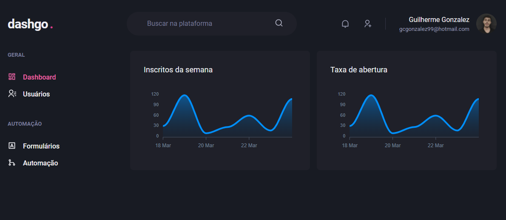

  <h1>:rocket: dashgo.  </h1>
  <h2>Ignite React Track Project</h2>
  
This project was developed during one of the chapters of Rocketseat's Ignite! The idea was to develop a dashboard using Chakra UI entirely, also making the application responsive.

  
The application was developed using the Next.js framework applying concepts such as consuming external APIs, API Root, Server Side Rendering (SSR), Static Site Generation (SSG), STRIPE for subscription payments, NextAuth for authentication with Github, FaunaDB to store user information in a database, and Prismic CMS for adding and managing post content.

## Technologies

* [React](https://reactjs.org/)
* [Next.js](https://nextjs.org/)
* [Chakra UI](https://chakra-ui.com/)
* [Yup](https://github.com/jquense/yup)
* [React Hook Form](https://react-hook-form.com/)

## Proposed Activities

- [x] Complete design with Chakra UI;
- [x] Responsiveness;
- [x] Form validation/error handling;

## Giving feedback

Feedback is always welcome, if you have any suggestions or questions please send me an email: gcgonzalez99@hotmail.com
